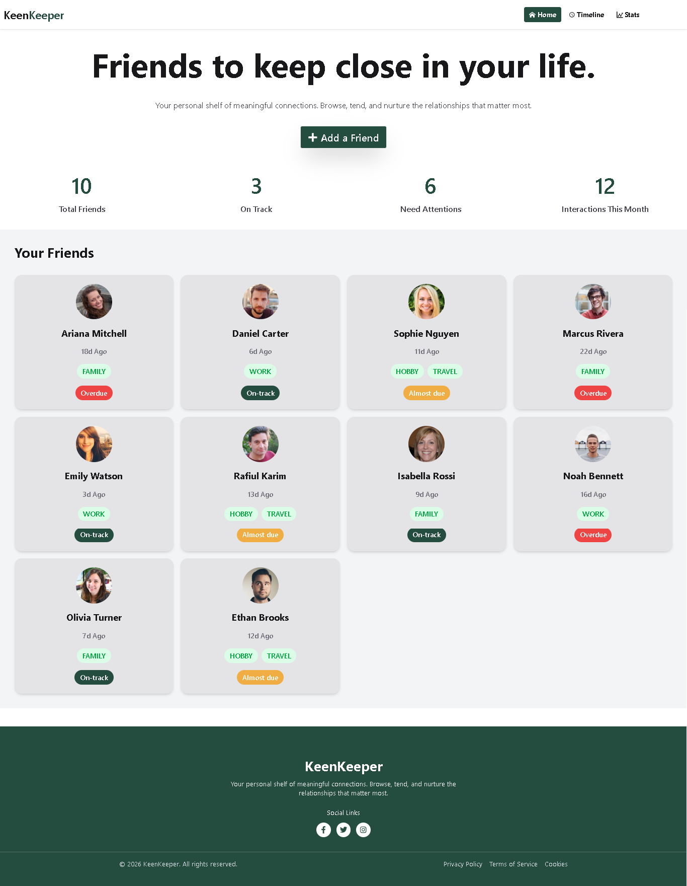

# 👤 KeenKeeper — Personal CRM & Friendship Tracker

KeenKeeper is a modern personal relationship management (CRM) application built with React. It helps users track, manage, and analyze interactions with their contacts through a clean timeline interface and a data-driven analytics dashboard.

---

## 🚀 Live Demo

🔗 [https://keenkeeper-react-7.netlify.app/](https://keenkeeper-react-7.netlify.app/)

---

## 🧰 Tech Stack

| Technology      | Role                                |
| --------------- | ----------------------------------- |
| React 18        | Component-based UI                  |
| React Router v6 | Routing, loaders, and data fetching |
| Context API     | Centralized state management        |
| Tailwind CSS    | Utility-first styling               |
| Recharts        | Data visualization                  |
| React Icons     | Icon system (Feather icons)         |
| React Spinners  | Loading states                      |
| React Toastify  | Notification system                 |
| Vite            | Fast development & build tooling    |

---

## ✨ Core Features

### 📋 Profile Management

* Dynamic profile listing powered by route loaders
* Individual contact detail view

### 📅 Interaction Timeline

* Track communication history (Call, Text, Video)
* Context-driven global state for real-time updates
* Clean, readable activity feed

### 📊 Analytics Dashboard

* Visual breakdown of interaction types
* Pie chart powered by Recharts
* Instant insights into communication patterns

### ⚡ UX Enhancements

* Smooth loading experience using `PuffLoader`
* Empty state UI for better clarity
* Toast notifications for user feedback
* Custom error boundary for invalid routes

---

## 📁 Project Architecture

```
src/
├── Components/
│   ├── HomePages/
│   │   └── Banner.jsx
│   └── Shared/
│       └── NavBar.jsx
│
├── context/
│   └── TimelineContext.jsx
│
├── Layout/
│   └── Root.jsx
│
├── Pages/
│   └── Home/
│       ├── Home.jsx
│       ├── Timeline.jsx
│       ├── Stats.jsx
│       └── ErrorPage.jsx
│
├── Profile/
│   ├── ProfileCard.jsx
│   ├── ProfileDetails.jsx
│   └── ProfileSection.jsx
│
├── main.jsx
└── index.css
```

---

## 🗺️ Application Routes

| Route                 | Component      | Description                     |
| --------------------- | -------------- | ------------------------------- |
| `/`                   | Home           | Loads and displays all profiles |
| `/ProfileDetails/:id` | ProfileDetails | Detailed contact view           |
| `/timeline`           | Timeline       | Full interaction history        |
| `/stats`              | Stats          | Analytics dashboard             |
| `*`                   | ErrorPage      | Fallback for invalid routes     |

---

## ⚙️ Getting Started

### Clone the repository

```bash
git clone https://github.com/mahdirafi/keenkeper-react-ass-7.git
cd keenkeper-react-ass-7
```

### Install dependencies

```bash
npm install
```

### Run development server

```bash
npm run dev
```

---

## 📦 Dependencies

```bash
react-router-dom
react-icons
react-spinners
recharts
react-toastify
tailwindcss
postcss
autoprefixer
```


---

## 🎯 Future Enhancements

* Persistent data storage (Firebase / MongoDB)
* Authentication & user accounts
* Interaction editing and filtering
* Advanced analytics (weekly/monthly trends)
* Mobile-first optimization

---

## 👨‍💻 Author

**Mahdi Rafi**
GitHub: [https://github.com/mahdirafi](https://github.com/mahdirafi)

---

## 📄 License

This project is open-source and available under the MIT License.

---

If you want to take this even further, next step would be:
## Home Page

 

Say the word and I’ll upgrade it again 👍
